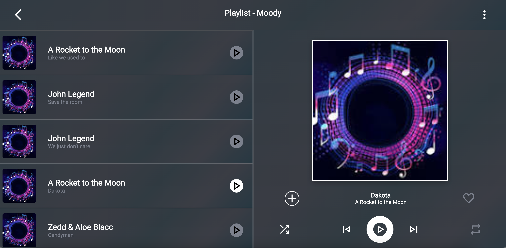
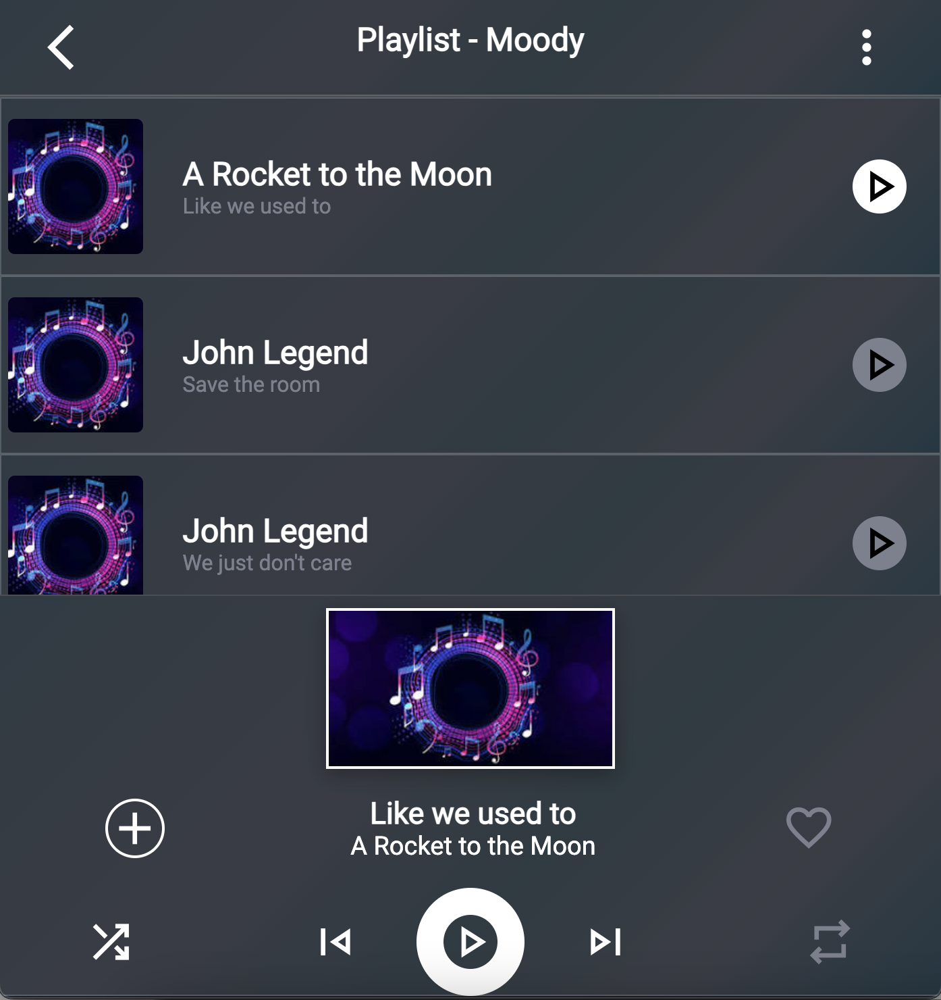

# React Media Player

This is a simple React Media Player built using React and TypeScript. The application displays a list of media items, and when an item is selected, it shows a player with media details and controls.



## Responsive for smaller screen



## Features

- Display a list of media items.
- Select a media item to view its details in the player.
- Highlight the selected media item.
- Responsive design: Adjusts layout for smaller screens.

## Technologies Used

- React
- TypeScript
- CSS

## Installation

To install and run this project locally, follow these steps:

1. **Clone the repository**

    ```bash
    git clone https://github.com/yourusername/react-media-player.git
    cd react-media-player
    ```

2. **Install dependencies**

    ```bash
    npm install
    ```

3. **Run the development server**

    ```bash
    npm run dev
    ```

4. **Open the application**

    Open your browser and navigate to `http://localhost:3000`.

## Usage

- Click on a media item in the playlist to view its details in the player.
- The play button background color will turn red when an item is selected.

## Project Structure

- `src`
  - `components`
    - `Header.tsx` - Header component
    - `Playlist.tsx` - Playlist component
    - `Player.tsx` - Player component
  - `data`
    - `data.ts` - Media items data
  - `interface`
    - `interface.ts` - TypeScript interfaces
  - `App.tsx` - Main App component
  - `index.tsx` - Entry point of the application
  - `styles`
    - `Header.css` - Header styles
    - `Playlist.css` - Playlist styles
    - `Player.css` - Player styles

## Screenshots


## License

This project is licensed under the MIT License - see the [LICENSE](LICENSE) file for details.

## Acknowledgements

- [React](https://reactjs.org/)
- [TypeScript](https://www.typescriptlang.org/)
- [Vite](https://vitejs.dev/)
- [Material Icons](https://material.io/resources/icons/)